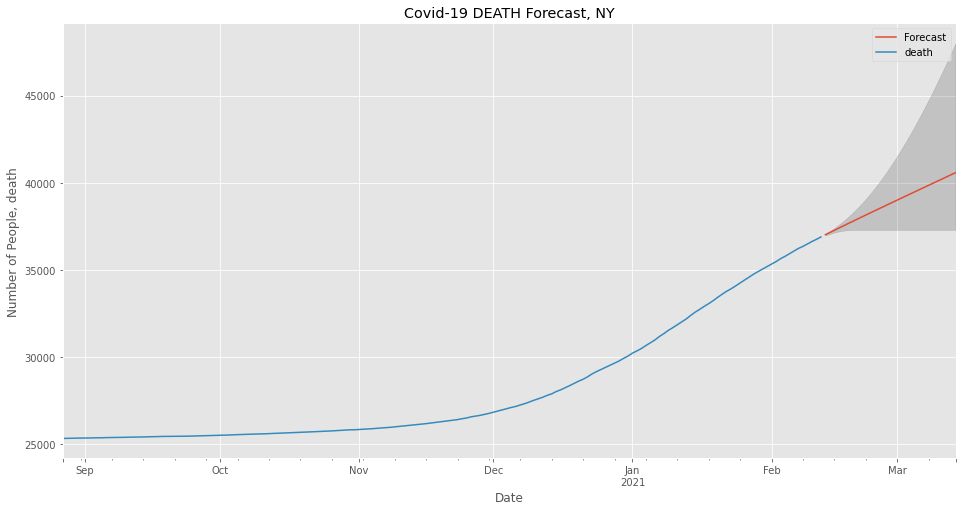
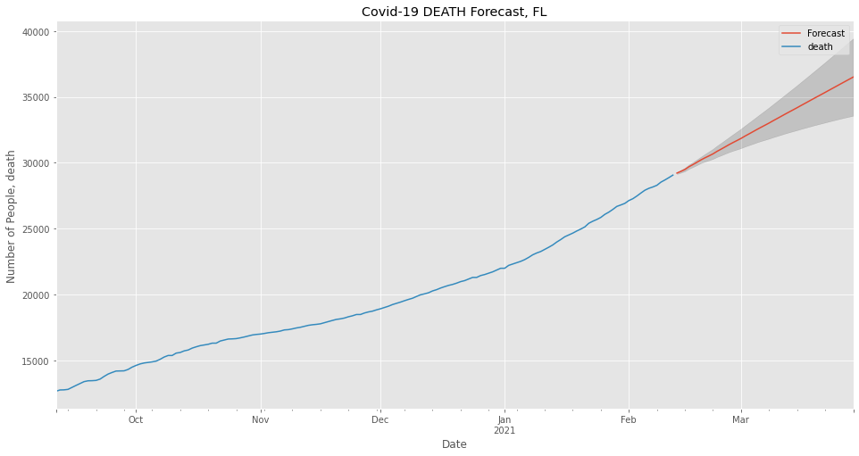

# Covid-19 Forecasting

##### [Slideshow PDF](Presentation PDF.pdf)

### Outline
* [Purpose](#Purpose)
* [The Data](#The-Data)
* [Summary Recommendations](#Summary-Recommendations)
* [Future Work](#Future-Work)

## Purpose

#### The purpose of this analysis is to provide an accurate forecast of Covid-19 related deaths as 2021 progresses.
##### Our challenges are -
##### * 1. Create forecasts for specific states
##### * 2. Build a forecast for the United States as a whole
##### * 3. Provide insights as to the urgency of making changes to how we are operating as a country

## Data

*[The Covid Tracking Project](https://covidtracking.com/)*
##### The Covid Tracking Project was organized by the news agency The Atlantic early in 2020 in an effort to provide as much data on the pandemic as possible. Coordination of state by state Covid data required building working relationships with state officials to obtain relevant state information. Above are links to the project that can provide further information regarding Covid-19. Additionally, it is worth noting that the project is coming to its end at the beginning of March 2021 as a result of improvements to Federal collection of data.

## The Approach 

##### The forecasting focuses on several key states for various reasons. New York was initially one of the hardest hit by the pandemic, flattening the curve with their efforts until the 2020 holiday season increased virus transmission. California continues to suffer and neared statewide ICU capacity as a result of the 2020 holidays. Florida, as a travel hub with no current travel restrictions (2-16-2021) is also a focal point of death forecasts and is undoubtedly negatively affecting efforts to reduce transmission by other states. 

##### Additionally, the forecasts are enhanced by different variables depending on the specific state's reporting. Some states report current ICU numbers but not ventilator data. For example, Texas's final death forecast takes into account the number of those currenly hospitalized instead of ICU numbers as they do not report ICU data. Wherever possible, the number of Covid patients currently on ventilators is used as an input to improve the forecasting of deaths. 

## Notebook Table of Contents

##### 1.1 Introduction
##### 1.2 Explore Data
##### 2.0 Modeling and Forecasts
##### 2.1 SARIMAX Modeling
##### 3.0 Summary Recommendations
##### 3.1 State by State Recommendations
##### 3.2 Conclusions
##### 3.3 Future Work

### Supervised Learning with SARIMA and SARIMAX 

#### New York Ventilator Forecast

#### New York Summary Forecast - This utilizes the forecast from the previous graph to enhance the death forecast

#### California Summary Forecast

##### California Covid-19 Deaths Forecast first forecasts the number of individuals with Covid who are in the ICU instead of Ventilator data

#### Florida Summary Forecast

##### Florida Covid-19 Deaths Forecast first forecasts the number of individuals with Covid who are hospitalized as neither ICU nor Ventilator figures were provided to the project. 

#### Texas Summary Forecast

##### Texas Covid-19 Deaths Forecast first forecasts the number of individuals with Covid who are hospitalized as neither ICU nor Ventilator figures were provided to the project. 

#### United States Summary Forecast

##### United States Covid-19 Deaths Forecast first forecasts the number of currently hospitalized individuals with Covid, then creates a SARIMAX model and forecast of deaths based on that forecast data.

## Summary Recommendations
##### * Wear a mask
##### * Stay away from people you don't live with
##### * Respect others' right to not catch the virus you might not know you have.

## Future Work
##### * Continue to update the analysis until the project ceases functioning on March 7th, 2021.
##### * Find a future source of data to actively pull in and compare future actual data with the forecasts in this notebook.

### A note about this project:
##### I chose to undertake this project for several reasons. It is relevant to what is happening now, and it has real implications in peoples' lives. On a much more personal level, it is frustrating to have three grandparents in their 90's whom I am unable to see at this time. Additionally, my mother has an auto-immune deficiency, which makes her risk around irresponsible individuals that much more real for me. 
##### Most people seem to be respectful enough to wear a mask, but after nearly a year many are growing tired of this simple task. I hope that respect for others will prevail over the desire for personal freedom. The covenant that we enter into as citizens is with each other. It's to protect each other, and it requires that we be considerate and understand that one person's wants (the desire to not wear a mask, to party, to have a good time) do not supercede the responsibility to protect our fellow Americans. 
##### With vaccine distribution occurring, we don't have much longer to endure the difficulties. 

### Thank you!
