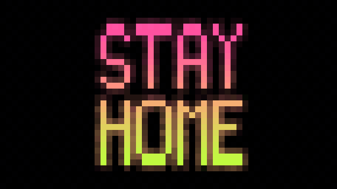
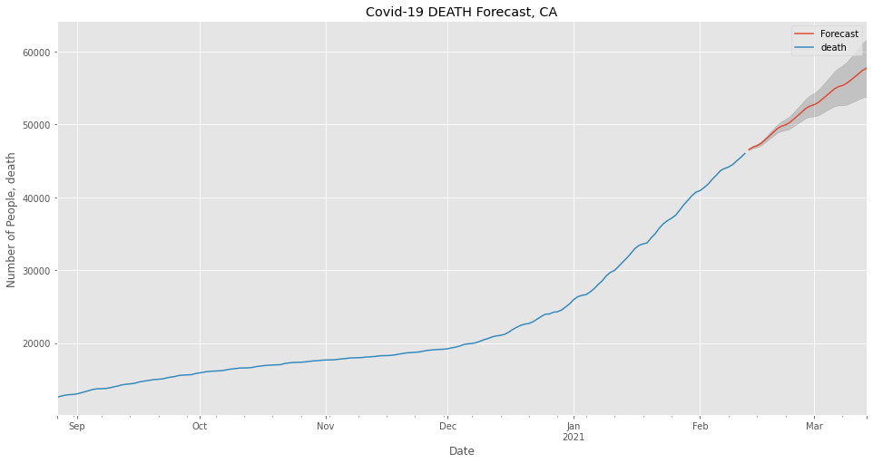
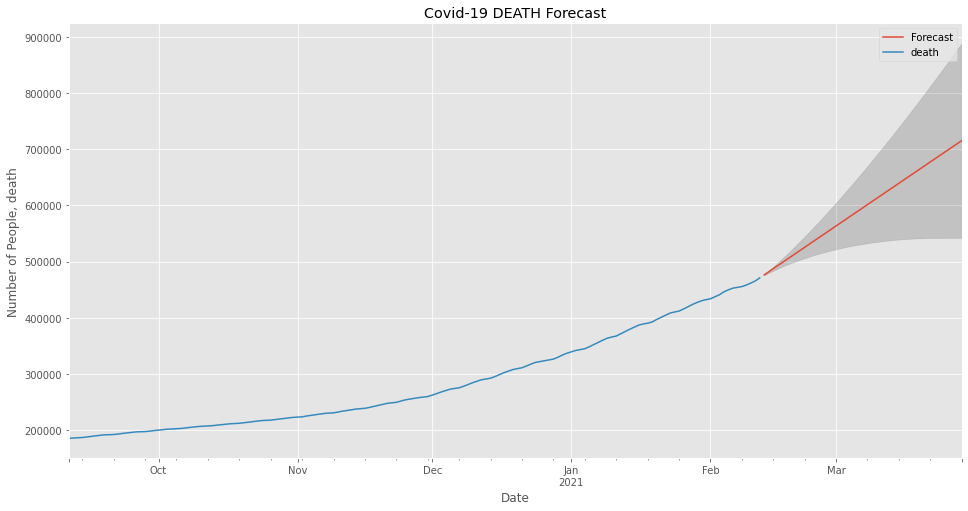

# Covid-19 Deaths Forecasting

##### [Slideshow PDF](Pdfs/Covid-19 Forecast.pdf)

### Outline
* [Purpose](#Purpose)
* [The Data](#The-Data)
* [Summary Recommendations](#Summary-Recommendations)
* [Future Work](#Future-Work)

## Purpose

#### The purpose of this analysis is to provide an accurate forecast of Covid-19 related deaths as 2021 progresses.
##### Our challenges are -
##### * 1. Create forecasts for specific states
##### * 2. Build a forecast for the United States as a whole
##### * 3. Provide insights as to the urgency of making changes to how we are operating as a country

## Data

*[The Covid Tracking Project](https://covidtracking.com/)*
##### The Covid Tracking Project was organized by the news agency The Atlantic early in 2020 in an effort to provide as much data on the pandemic as possible. Coordination of state by state Covid data required building working relationships with state officials to obtain relevant state information. Above are links to the project that can provide further information regarding Covid-19. Additionally, it is worth noting that the project is coming to its end at the beginning of March 2021 as a result of improvements to Federal collection of data.

## Notebook Table of Contents

##### 1.1 Introduction
##### 1.2 Explore Data
##### 2.0 Modeling and Forecasts
##### 2.1 SARIMAX Modeling
##### 3.0 Summary Recommendations
##### 3.1 State by State Recommendations
##### 3.2 Conclusions
##### 3.3 Future Work

### Supervised Learning with SARIMA and SARIMAX 

#### California Summary Forecast

##### California Covid-19 Deaths Forecast first forecasts the number of individuals with Covid who are in the ICU, then creates a SARIMAX model and forecast of deaths based on that forecast data.

#### United States Summary Forecast

##### United States Covid-19 Deaths Forecast first forecasts the number of currently hospitalized individuals with Covid, then creates a SARIMAX model and forecast of deaths based on that forecast data.

## Summary Recommendations
##### * WEAR A MASK
##### * STAY AWAY FROM PEOPLE YOU DONT LIVE WITH
##### * Respect others' right to not catch the virus you might not know you have.

## Future Work
##### * Continue to update the analysis until the project ceases functioning on March 7th, 2021.
##### * Find a future source of data to actively pull in and compare future actual data with the forecasts in this notebook.

### A note about this project:
##### I chose to undertake this project for several reasons. It is relevant to what is happening now, and it has real implications on peoples' lives. On a much more personal level, it is frustrating to have three grandparents in their 90's all of whom I am unable to see during this time. Additionally, my mother has an auto-immune deficiency, which makes her risk around others who are irresponsible that much more real for me. 
##### Most people seem to be respectful enough to wear a mask, but after nearly a year many are growing tired of the simple task. One hopes that respect for others would prevail over the desire to have 'freedom' to do as one pleases. The covenant that we enter into as citizens is with each other. It's to protect each other, be considerate, and be understanding that one person's wants (the desire to not wear a mask, to party, to have a good time) do not supercede the responsibility to protect our fellow Americans. 
##### Furthermore, the argument for personal freedom is in this case ridiculous - it's akin to arguing that one should have the personal freedom to walk around shooting anyone you please simply because you deserve that 'freedom'. With vaccine distribution occurring, we don't have much longer to endure the difficulties. 

### Thank you!
